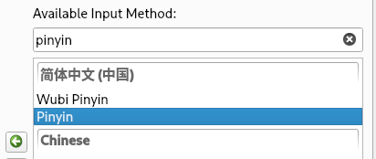

<h1 align="center"> Arch Linux 系统安装记录 <h1>

### 安装前准备工作

<details>
<summary>镜像下载及烧录</summary>
<br />

> 系统镜像下载
```
https://archlinux.org/download/
```

> 镜像写入工具
```
[ BalenaEther ]     https://www.balena.io/etcher/
[ Ventoy ]          https://www.ventoy.net/cn/download.html
```

成功写入后进入`BIOS`
  - 关闭安全启动模式 `Secure Boot`
  - 调整启动项顺序或直接选择使用 **UEFI 模式** 启动U盘内镜像

如何进入 BIOS 请自行百度 这里不再赘述

</details>

## 安装 Arch Linux

### 启动检查

----

> 启动完成后速速禁用 reflector 服务，防止此服务擅自删除国内镜像源
```
systemctl stop reflector.service
systemctl disable reflector.service
```

> 检查当前是否为 `UEFI` 模式启动
```
ls /sys/firmware/efi/efivars    [ 有输出则是 UEFI 模式 ]
```

> 检查网络是否连接
```
ping www.bilibili.com
```

> 更新系统时间
```
timedatectl set-ntp true
```

> 更换国内镜像源，放在文件开头
```
[ vim /etc/pacman.d/mirrorlist ]

Server = https://mirrors.ustc.edu.cn/archlinux/$repo/os/$arch
Server = https://mirrors.tuna.tsinghua.edu.cn/archlinux/$repo/os/$arch
```

### 磁盘分区

----

> 查看当前分区状况
```
[ lsblk ]

[ NVMe ]
NAME         MAJ:MIN  RM    SIZE  RO  TYPE  MOUNTPOINTS
nvme0n1      259:0     0   1004G   0  disk
├─nvme0n1p1  259:1     0      1G   0  part  /boot
├─nvme0n1p2  259:2     0      8G   0  part  [SWAP]
└─nvme0n1p3  259:3     0    905G   0  part  /

[ SATA ]
NAME         MAJ:MIN  RM    SIZE  RO  TYPE  MOUNTPOINTS
sda          259:0     0   1004G   0  disk
├─sda1       259:1     0      1G   0  part  /boot
├─sda2       259:2     0      8G   0  part  [SWAP]
└─sda3       259:3     0    905G   0  part  /
```

> 确定为我们的目标硬盘 [ nvme0n1 / sda ] 后 运行可视化分区程序 [ `cfdisk` ]
```
[ NVMe ] cfdisk /dev/nvme0n1
[ SATA ] cfdisk /dev/sda
```

基本操作：
- `↑` / `↓` 上下移动选择目标子卷
- `←` / `→` 切换对选中目标子卷的操作
- `<ENTER>` 执行 `←` / `→` 选中的操作
- `d`       删除目标分区

> 我们按照如下方法进行分区
```
[ NVMe ]
/dev/nvme0n1p1 - EFI System        [ EFI 启动分区 512M ]
/dev/nvme0n1p2 - Linux swap        [ 交换分区 与内存大小相等 ]
/dev/nvme0n1p3 - Linux filesystem  [ 根分区 余下全部大小 ]

[ SATA ]
/dev/sda1 - EFI System             [ EFI 启动分区 512M ]
/dev/sda2 - Linux swap             [ 交换分区 与内存大小相等 ]
/dev/sda3 - Linux filesystem       [ 根分区 余下全部大小 ]
```

> 分区完毕后 我们需要格式化一下刚刚分出来的区域
```
mkfs.fat -F32 /dev/nvme0n1p1   [ 将 EFI 启动分区格式化为 FAT32 格式 ]

mkswap /dev/nvme0n1p2          [ 建立 SWAP 交换分区 ]
swapon /dev/nvme0n1p2          [ 启用 SWAP 交换分区 ]

mkfs.xfs /dev/nvme0n1p3        [ 将根分区格式化为 XFS 文件系统 ]
```

> 格式化后 我们需要将这几个块设备挂载到 /mnt 目录 否则无法对其进行操作 [ 可以把挂载简单理解为映射]
```
mount /dev/nvme0n1p3 /mnt          [ 将根目录挂载到 /mnt 上 现在的 /mnt 相当于我们要安装系统的根目录 ]

mkdir /mnt/boot                    [ 创建新系统的启动目录 ]
mount /dev/nvme0n1p1 /mnt/boot     [ 将 EFI 启动目录挂载到新系统的 /boot 目录下 ]
```

现在 我们已经拥有一个可以启动的系统了 但系统里除了有一个 [ `/boot` ] 启动目录 其他什么都没有 就算能启动也无法进行任何操作

喝杯啤酒庆祝一下吧 🍺

----

### 系统核心安装

----

<details>
<summary>章节知识点</summary>
<br />

> 命令简介
```
- pacstrap    [ 将软件包安装到新的根目录中 ]
```

> 内核版本
```
- Stable     [ 原版的 Linux 内核和模块 ]
- Longterm   [ 受长期支持的 Linux 内核和模块 ]
- Hardened   [ 注重安全的 Linux 内核 采用一系列加固补丁以缓解内核和用户空间漏洞 ]
- Zen Kernel [ 一些内核黑客合作开发的成功 是最适合日常使用的内核 ]
```

</details>

<br />

> 安装必要组件
```
pacstrap /mnt linux          [ 系统内核 ]
pacstrap /mnt linux-firmware [  ]

pcastrap /mnt base           [  ]
pacstrap /mnt base-devel     [ AUR 构建工具 ]
```

> 安装功能性软件
```
pacstarp /mnt vim
pacstarp /mnt
pacstarp /mnt
pacstarp /mnt
pacstarp /mnt
```


### Nvidia 驱动安装

----

安装显卡驱动时，请尽量避免从 NVIDIA 官网下载驱动包进行安装

通过 [ `pacman` ] 来安装的 NVIDIA 驱动能够在更新系统时与其他组件一同更新

<details>
<summary> 官方文档 </summary>

    支持的显卡：
    GeForce 930起、10系至20系、 Quadro/Tesla/Tegra K-系列以及更新的显卡（NV110以及更新的显卡家族），安装 nvidia （用于linux） 或者 nvidia-lts （用于linux-lts）
    假如您是使用最新的显卡，如果以上两个驱动安装后都不能正常工作，您也许需要使用 nvidia-betaAUR 和 nvidia-utils-betaAUR 来获得支持
    2013年至2014年左右的开普勒（NVE0）系列（包括GeForce 630-920），安装nvidia-470xx-dkmsAUR
    GeForce 400/500/600 系列（ NVCx 以及 NVDx ），大概是2010年至2011年的显卡，安装 nvidia-390xx-dkmsAUR.
    对32位应用程序支持，请安装multilib仓库中对应的 lib32 nvidia 软件包（例如lib32-nvidia-utils）

    老显卡：
    如果你的显卡是 GeForce 300 系列或者更老的（发布于2010年及之前），Nvidia不再为这些显卡提供驱动。这意味着这些驱动不支持现在的Xorg版本。因此使用 Nouveau 驱动可能会更方便，因为它依然为这些老显卡提供对当前Xorg的支持。
    但是，Nvidia 依然提供 legacy 驱动，并且或许拥有更好的 3D 性能（稳定性）。
    GeForce 8/9、ION以及100至300系列显卡（NV5x、NV8x、NV9x以及NVAx），安装 nvidia-340xx-dkmsAUR。
    GeForce 7系列及更老的显卡（NV6x、NV4x及以下），Arch Linux没有相应的驱动包。

</details><br />

> 我的显卡是 RTX 2080Ti 所以我选择安装以下包
```
sudo pacman -S nvidia nvidia-utils lib32-nvidia-utils
```

----

## 软件安装

Arch 下有很多包管理工具，其中比较流行的有
```
pacman      [ Arch 自带包管理工具 不是很全 安装必须使用 sudo 提升权限 ]
yay         [ Go 语言开发的包管理工具 ]
paru        [ Rust 开发的包管理工具 ]
```

这里我们使用 [ `paru` ] 安装与管理软件

> 安装 [ `paru` ]
```
sudo pacman -Syyu   [ 让本地 pacman 软件版本数据库与云端同步并更新所有软件 ]
sudo pacman -S paru [ 使用 pacman 安装 paru ]
```

> [ `paru` ] 的基本使用
```
paru -Syyu      [ 更新本地软件并刷新软件版本数据库 ]
paru -S xxx     [ 安装 xxx ]
paru -R xxx     [ 卸载 xxx ]
```

> 题外话：安装软件时软件后缀带 `-git` 与不带 `-git` 的区别？
```
xxx-bin     [ 一般是编译好的二进制文件 下载即可使用 无需自行编译 无法保证是最新的 ]
xxx-git     [ 从 GitHub 克隆软件源码到本地编译安装 软件是最新版本 可能存在不稳定的情况 ] ```
```

*注意：编译需要一定的时间 视 CPU 性能而定 若环境配置不当 [ 如缺少编译工具 ] 编译大概率会失败*

### Fish Shell

----

> 安装 oh-my-fish
```bash
curl https://raw.githubusercontent.com/oh-my-fish/oh-my-fish/master/bin/install | fish
```

> 安装 autojump
```bashy
yay -S autojump-git
```

> 在 config.fish 中索引 autojump 文件
```bash
source ~/.autojump/share/autojump/autojump.fish
```

<details>
<summary>笔者的 Fish Shell 配置</summary>

```fish
function fish_greeting
    echo " --        __  ___   _________  __ ____  ____________________________      --  "
    echo " --       / / / / | / / ____/ |/ // __ \/ ____/ ____/_  __/ ____/ __ \     --  "
    echo " --      / / / /  |/ / __/  |   // /_/ / __/ / /     / / / __/ / / / /     --  "
    echo " --     / /_/ / /|  / /___ /   |/ ____/ /___/ /___  / / / /___/ /_/ /      --  "
    echo " --     \____/_/ |_/_____//_/|_/_/   /_____/\____/ /_/ /_____/_____/       --  "
    echo " --                                                                        --  "
    set_color '6C5B9E'
    echo " [  $hostname : $USER ] [ $(date +%T\ %m-%d) ] "
end

function fish_title
    echo $argv[1] (prompt_pwd)
end

# SET PROMPT
function fish_prompt
    set -l cwd $(pwd | sed "s:^$HOME:~:")
    echo "$(set_color 'C53B82') [$(set_color 'BBE73D') $cwd $(set_color 'C53B82')]$(set_color 'C1E94F') [ "
end

function fish_right_prompt
    set -l git_branch (command git symbolic-ref HEAD 2> /dev/null | sed -e 's|^refs/heads/||')
    echo "$(set_color '6C5B9E') $git_branch  $(set_color 'C1E94F') ] $(set_color '686868')$(date +%H:%M\ %a)  "
end


# ENABLE VI-MODE
function fish_user_key_bindings
    # ENABLE EMACS KEYBINDINGS
    fish_default_key_bindings -M insert

    # ENABLE VI KEYBINDINGS
    fish_vi_key_bindings --no-erase insert
end

# SET VI-MODE CURSOR SHAPE
set fish_cursor_default block
set fish_cursor_insert line blink
set fish_cursor_visual block
set fish_cursor_replace_one underscore

# SET KEYBINDINGS
bind -M default 'L' end-of-line repaint
bind -M default 'H' beginning-of-line repaint
bind -M default \e accept-autosuggestion repaint


# SET ALIAS
alias  c         "cd ~/t00ls/Clash/ && nohup ./clash-1.8.0 -d . &"
alias  ficonf    "nvim ~/.config/fish/config.fish"
alias  alconf    "nvim ~/.alacritty.yml"
alias  nvimconf  "nvim ~/.config/nvim/init.lua"
alias  plugconf  "nvim ~/.config/nvim/lua/core/plugins.lua"
alias  setconf   "nvim ~/.config/nvim/lua/core/options.lua"
alias  mapconf   "nvim ~/.config/nvim/lua/core/keymaps.lua"
alias  renvim    "rm -rf ~/.local/share/nvim ~/.cache/nvim && \
        git clone --depth 1 https://github.com/wbthomason/packer.nvim ~/.local/share/nvim/site/pack/packer/start/packer.nvim"

alias  upnvim    "yay --noconfirm -Rns neovim-git && yay -S --noconfirm neovim-git && \
        sudo rm /usr/share/nvim/runtime/colors/*"
alias  gpa       "git add . && git commit -m 'UPDATE' && git push -u origin main"

alias  ..    "cd .."
alias  ...   "cd ../.."
alias  ra    "ranger"
alias  ls    "exa"
alias  ll    "exa -l"
alias  cat   "bat"
alias  grep  "ripgrep"
alias  top   "glances"
alias  f     "trans -l zh -to zh -j -speak -indent 8"
alias  u     "sudo pacman -Syyu && yay -Syyu"
alias  e     "nvim --startuptime /tmp/nvim-time.log --noplugin -i NONE"
alias  vi    "nvim --startuptime /tmp/nvim-time.log -u ~/.config/nvim/zen/init.lua -i NONE --noplugin"
alias  t     "tail -n 30 /tmp/nvim-time.log && rm /tmp/nvim-time.log"
alias  sd    "shutdown -h now"
alias  rb    "reboot"

# ABBREV
abbr yi "yay -S"
abbr pi "sudo pacman -S"
abbr ss "sudo systemctl"

# function rm
#     mv -i $argv ~/.local/share/Trash/files/
# end

set EDITOR "nvim"

source ~/.autojump/share/autojump/autojump.fish
```

</details>

----

### Alacritty

Alacritty 是一个 GPU 加速渲染的终端模拟器，启动快速丝滑，非常好用

> 安装

```
paru -S alacritty-git
```

----

<details>
<summary>官方配置文档</summary>

<https://github.com/alacritty/alacritty/blob/master/alacritty.yml>

</details>

<details>
<summary>笔者的 Alacritty 配置</summary>

```yml

env:
  TERM: alacritty
  http_proxy: http://192.168.42.129:7890/
  https_proxy: http://192.168.42.129:7890/

# 热加载
live_config_reload: true

mouse_bindings:
  - { mouse: Right, action: Paste }

key_bindings:
  - { key: Escape,  mods: Control,  action: ToggleViMode }
  - { key: W,       mods: Control,  action: quit }
  - { key: J,       mods: Shift,    action: ScrollHalfPageDown,  mode: Vi }
  - { key: K,       mods: Shift,    action: ScrollHalfPageUp,    mode: Vi }

window:
  # GTK 主题
  decorations_theme_variant: dark

  # 是否显示顶栏 full / none
  decorations: full

  # 窗口大小
  dimensions:
    columns: 210
    lines: 40

  # 透明度
  opacity: 0.80

  # 是否开启动态标题
  dynamic_title: true

# Nerd Font Mono / Monaco
# ShureTech      Ubuntu
# JetBrains      Aurulent
# InconsolataGo  Blex
# CaskaydiaCove  Cousine
# BitstreamVera  MesloLGS                
font:
  # 字体大小
  size: 11
  # 字间距
  offset:
    x: 0
    y: 0

  normal:
    family: 'JetBrainsMono Nerd Font Mono'
    style: Regular

  bold:
    family: 'JetBrainsMono Nerd Font Mono'
    style: Bold

  italic:
    family: 'JetBrainsMono Nerd Font Mono'
    style: Italic

  bold_itali:
    family: 'JetBrainsMono Nerd Font Mono'
    style: Bold Italic


colors:
  primary:
    background: '#222222'
    foreground: '#626262'

  normal:
    black:   '#252525'
    grey:    '#555555'
    red:     '#E73E95'
    green:   '#BBE73D'
    yellow:  '#DEA600'
    purple:  '#AF87D7'
    bpurple: '#614F97'
    orange:  '#FF9121'
    blue:    '#008FBF'
    magenta: '#FF79C6'
    cyan:    '#8BE9FD'
    white:   '#DDDDDD'

  bright:
    black:   '#222222'
    red:     '#E73E95'
    green:   '#BBE73D'
    yellow:  '#DEA600'
    purple:  '#AF87D7'
    bpurple: '#614F97'
    orange:  '#FF9121'
    blue:    '#008FBF'
    magenta: '#FF79C6'
    cyan:    '#8BE9FD'
    white:   '#DDDDDD'

selection:
  semantic_escape_chars: ",`|\"' ()[]{}<>\t@="
  save_to_clipboard: true

mouse:
  hide_when_typing: true

url:
  modifiers: Command
```

</details>

---

### GIT

> 安装 GIT
```
paru -S git-git
```

> 配置 GIT 个人信息
```
git config --global user.name "NEX"
git config --global user.email "veperx@icloud.com"
```

> 配置 GIT 文本编辑器
```
git config --global core.editor nvim
```

> 配置 GIT 差异分析工具
```
git config --global merge.tool nvimdiff
```

----

<details>
<summary>GitHub 添加 SSH</summary>
<br />

> 生成 SSH-Key
```
ssh-keygen -t rsa -C "GitHub Email“
```

> GitHub 添加生成公钥
```
打开 GitHub -> 右上角 Settings -> 左栏 SSH and GPG Keys -> New SSH Key

标题可随意填写 下方输入框内填写公钥内容 [ ~/.ssh/id_rsa.pub ]
```

</details>

----

### Chrome

----

> 安装
```
paru -S google-chrome
```

> 插件推荐
```
HackBar [ 这个干嘛的不能说 ]
Vimium  [ 用 VIM 键位浏览网页 效率UPUP ^_^ ]
AdBlock [ 屏蔽广告小插件 ]

Wappalyzer          [ 网站指纹识别 ]
Grammarly           [ 自动检查英语语法并提出建议 ]
SingleFile          [ 保存网页到一个 HTML 文件 ]
Bookmark Sidebar    [ 侧栏显示收藏书签 ]
Infinity New Tab    [ 美化新标签页 ]
Simple Translate    [ 划词翻译 支持 DeepL API ]
Proxy SwitchyOmega  [ 快速切换浏览器代理 ]

JavaScript and CSS Beautifier   [ 自动格式化 JS CSS 源码 ]
```


### Fcitx 5
----

Fcitx 5 只是一个基本的输入法框架，若要输入中文则需要额外安装中文包

> 安装基本框架
```
paru -S fcitx5-git              [ 基本框架 ]
paru -S fcitx5-gtk-git          [ GTK 兼容模块 ]
paru -S fcitx5-configtool-git   [ 框架配置工具 ]
```

> 安装中文拓展包
```
paru -S fcitx5-chinese-addons-git
```

> 安装皮肤 [ 可选 ]
```
paru -S fcitx5-nord
```

> 编辑 [ `/etc/environment` ] 加入以下内容
```
GTK_IM_MODULE=fcitx
QT_IM_MODULE=fcitx
XMODIFIERS=@im=fcitx
SDL_IM_MODULE=fcitx
GLFW_IM_MODULE=ibus
```

> 重启后在应用列表搜索 `fcitx5` 打开 `configuration`


> 右侧搜素栏搜索 `pinyin` 并双击 [ 或者点击箭头移到左边 ]



> 点击下方 Apply 应用更改，重启系统后就可以使用 [ `Ctrl-空格` ] 切换输入了

----

**配置 Fcitx 5 [ 可选 ]**


<details>
<summary>常用配置项</summary>
<br />

若不满意 Fcitx 5 的默认配置，可以到 [ `fcitx5 configuration` ] 里配置

> [ `Global OPptions` ]
```
Trigger Input Method     [ 切换输入模式 默认 Ctrl+空格 ]
Temporally switch ...    [ 临时切换中英文 默认 Left Shift ]
Default Previous Page    [ 结果上一页 ]
Default Next Page        [ 结果下一页 ]
Default Next Candidate   [ 选中下一个结果 ]
```

> [ `Addons` ]
```
Classic User Interface      [ Fcitx5 UI 设置 ]
  - Font    [ 字体 ]
  - Theme   [ 主题 ]
```

</details>

----

### VMware Workstation 16

----

> Windows 16 Professional 激活码
```
P4KWK-XDQTK-XYMCQ-GX6QJ-RCDVM
```

> 没有找到 Vmmon
```
yay -S linux519-headers
```

> 开机启动 VMware 网络服务 [ 不然虚拟机开启可能无法上网 ]
```
sudo systemctl enable vmware-networks.service
```

### Spotify

> 安装
```
paru -S spotify
```


### 其他配置

----

<details><summary>GNOME 添加快捷键</summary>

> [ `Settings` ] -> [ `Keyboard` ] -> [ `Keyboard Shortcuts` ]
```
[ Custome Shortcuts ]

- ALACRITTY
Command:    alacritty
Shortcut:   Alt + ;
```

```
[ BuiltIn Shortcuts ]

[ Ctrl  + w ]   Close Window
[ Ctrl  + e ]   Home Folder
[ Ctrl  + b ]   Launch Web Browser
[ Super + f ]   FullScreen Toggle
[ Super + h ]   Move window one monitor to the left
[ Super + l ]   Move window one monitor to the right
[ Super + j ]   Next Track
[ Super + k ]   Previous Track
[ Super + s ]   Play / Pause
```

</details>

----
